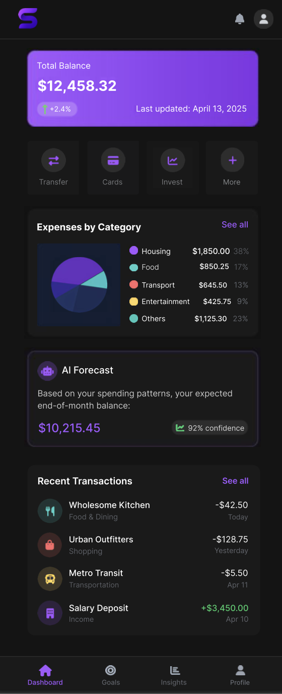

# SmartBudget - FIAP Fintech

<div align="center">
  
</div>

## 📋 Sobre o Projeto

SmartBudget é uma interface de aplicativo financeiro (Fintech) desenvolvida como parte da atividade acadêmica da FIAP. O objetivo foi recriar com fidelidade uma tela de dashboard financeiro utilizando HTML, CSS e Bootstrap, seguindo as diretrizes de design responsivo e boas práticas de desenvolvimento web.

O projeto apresenta uma solução moderna e intuitiva para gerenciamento de finanças pessoais, com visualização de saldo, categorização de despesas, previsão com IA e histórico de transações.

## 🚀 Tecnologias Utilizadas

- **HTML5** - Estrutura semântica
- **CSS3** - Estilização e animações
- **Bootstrap 5** - Framework CSS para design responsivo
- **Font Awesome** - Biblioteca de ícones
- **SVG** - Para o logotipo e elementos visuais

## ✨ Funcionalidades Implementadas

- **Dashboard Principal** - Visualização clara do saldo total e tendências
- **Categorização de Despesas** - Gráfico de pizza e detalhamento por categoria
- **Previsão Financeira com IA** - Estimativa de saldo futuro baseada em padrões de gastos
- **Histórico de Transações** - Lista das movimentações recentes com categorização
- **Design Responsivo** - Adaptação perfeita para dispositivos móveis e desktop
- **Navegação Intuitiva** - Menu de fácil acesso às principais funcionalidades

## 📱 Responsividade

O projeto foi desenvolvido seguindo o conceito de Mobile First e apresenta dois layouts distintos:

### Layout Mobile
- Menu de navegação na parte inferior
- Cards empilhados para melhor visualização em telas pequenas
- Design compacto otimizado para toque

### Layout Desktop
- Menu de navegação lateral com exibição em grid
- Layout em duas colunas para melhor aproveitamento do espaço
- Visualização expandida de gráficos e dados

## 🔍 Preview

Para visualizar o projeto:

1. Clone este repositório
```bash
git clone https://github.com/seu-usuario/FIAP-Fintech.git
```

2. Abra o arquivo `index.html` em qualquer navegador web moderno

Ou acesse a [versão demo online](#) (em breve)

## 📚 Detalhes Técnicos

- **CSS Personalizado** - Variáveis CSS para tema consistente
- **Layout Grid e Flexbox** - Organização moderna e flexível dos elementos
- **Gráfico em CSS** - Implementação de gráfico circular usando CSS puro
- **Sidebar Responsiva** - Menu que se adapta conforme o tamanho da tela

## 🎨 Referência de Design

Este projeto foi baseado na imagem de referência fornecida (`reference.png`), que serviu como guia para a implementação da interface.

## 👨‍💻 Autor

Desenvolvido para a atividade acadêmica da FIAP - Sistemas para Internet.

---

<div align="center">
  <p>2023 SmartBudget - FIAP Fintech</p>
</div>